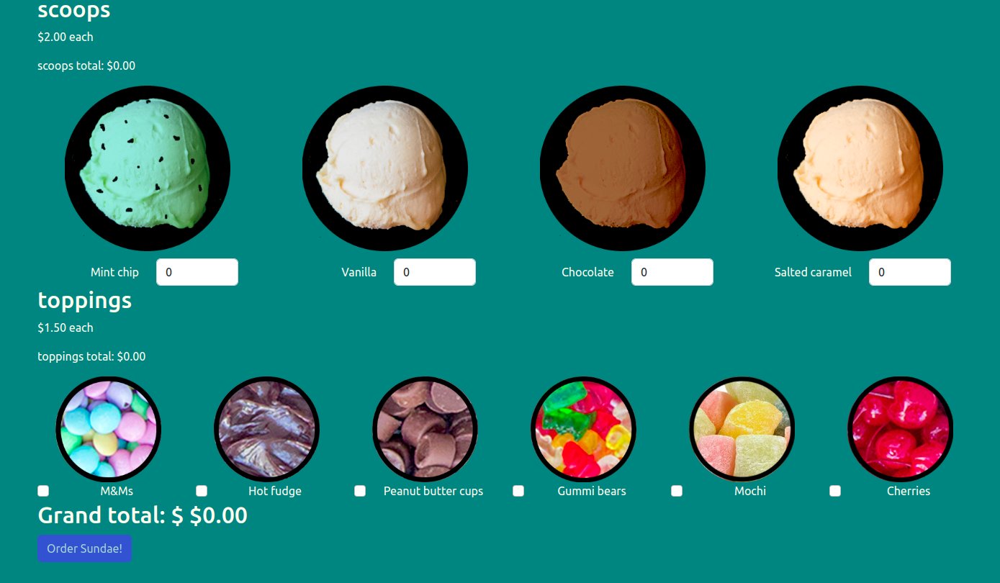
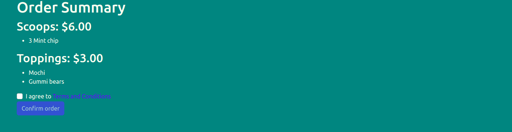

# Testing React with Jest and React Testing Library

React Testing Library has become an extremely popular option for testing React, and with good reason! This detailed, comprehensive course provides a solid foundation for React app tests.

## What I learned

- Testing simple and complex React applications with React Testing Library
- Making the most of Jest watch mode, including running only one file or test at a time
- React Testing best Practices: how to test behavior instead of implementation
- Common errors returned by Testing Library and how to correct them

### Built with

- React JS 18
- Vite
- Semantic UI
- Jest
- React Testing Library
- Eslint & Prettier

## Installation

This React project has been created using [Vite](https://vitejs.dev/guide/).

Step 1:

You need to install yarn. Yarn is a package and library manager.

Step 2:

```bash
git clone https://github.com/bryanAguilar001/react-jest-testing-library-app.git
cd testing-react-app
```

Step 3:

Run this command to install libs

```bash
yarn
```

Step 4:

Download and run the server [in this repo](https://github.com/bonnie/udemy-TESTING-LIBRARY/tree/main/sundae-server)

Step 5:

Run the app

```bash
yarn start
```

Step 6:

Run tests (It is not necessary to run the server for testing)

```bash
yarn test
```

## Author

- Website - [bryanaguilar](https://www.bryan-aguilar.com/)
- Medium - [bryanaguilar6174](https://bryanaguilar6174.medium.com/)
- LinkeIn - [bryanaguilar6174](https://www.linkedin.com/in/bryanaguilar6174)

## Application






